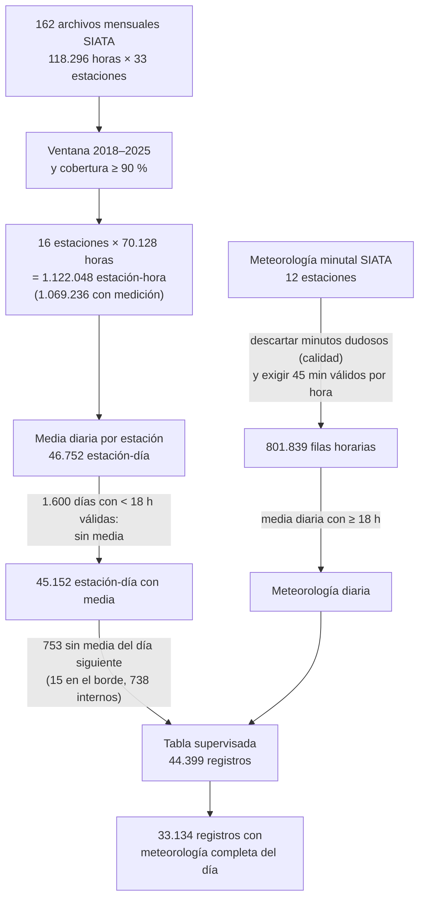

# Respuestas a las dudas del profesor

Las cifras marcadas como **verificadas** se calcularon el 2026-10-01 con los
162 archivos de `data/raw/pm25/` y el loader del repositorio, o ya aparecen en
el notebook `01_eda_pm25.ipynb`. Las marcadas como **propuesta** son
decisiones nuestras todavía abiertas.

## 1. ¿Por qué 5 estaciones en un archivo y después muchas?

**Respuesta corta para la clase.** SIATA publica un archivo por mes y cada
archivo solo trae las estaciones que existían ese mes. El notebook muestra
primero enero de 2013, cuando la red tenía 5 estaciones (`fecha_hora` es la
sexta columna). La red creció sobre todo entre agosto de 2017 y marzo de 2018.
Al unir los 162 archivos aparecen 33 estaciones distintas en total, con 30
combinaciones de columnas. De esas 33 usamos 16: las que tienen datos en al
menos el 90 % de las horas de 2018–2025.

Estaciones por año (**verificado**):

| Año | Estaciones con algún dato | Con ≥90 % de horas |
| --- | --- | --- |
| 2013 | 5 | 4 |
| 2014 | 6 | 5 |
| 2015 | 9 | 4 |
| 2016 | 8 | 5 |
| 2017 | 20 | 7 |
| 2018 | 24 | 19 |
| 2019–2025 | 23–26 | 18–21 |
| 2026 (ene–jun) | 23 | 21 |

La tabla de cobertura del notebook (sección 5, la de la captura) lista las
33 estaciones de la historia, cada una medida solo en su propio periodo
activo; por eso conviven estaciones de 2013 con estaciones de 2018 y algunas
ya retiradas (MED-UNNV en 2020, CAL-LASA en 2022).

## 2. ¿Por qué la ventana 2018–2025 y no todos los años?

Porque antes de 2018 casi no había estaciones. Si se exige 90 % de
cobertura, el número de estaciones depende mucho del año en que empieza la
ventana (**verificado**):

| Ventana | Estaciones con ≥90 % de cobertura |
| --- | --- |
| 2013–2025 | 3 |
| 2017–2025 | 4 |
| **2018–2025** | **16** |
| 2019–2025 | 17 |

Empezar en 2018 da 16 estaciones con ocho años completos. Empezar en 2019
gana una estación y pierde un año con 140 días-estación en Nivel de
Prevención. 2026 queda fuera porque solo tiene seis meses publicados.

**Texto borrador para el paper (sección IV-A):**

> No se usó todo el histórico porque la red tenía entre 5 y 9 estaciones
> hasta 2016 y creció a 24 entre agosto de 2017 y marzo de 2018. Con una
> ventana desde 2013 solo tres estaciones alcanzan el 90 % de cobertura;
> desde 2018, dieciséis. La ventana 2018–2025 equilibra el número de
> estaciones y la longitud de la serie, y conserva ocho años completos.

## 3. Faltantes: qué había y qué se hizo

Sí había faltantes. La regla fue: no se inventan valores; un día solo tiene
media si tiene suficientes horas medidas, y un registro solo entra al modelo
si tiene media hoy y mañana. Cada paso, con los registros que quedan
(**verificado**, todas las cifras están en el notebook):

Los faltantes meteorológicos (25 % de los registros sin el día completo) se
dejan como vacíos: XGBoost los admite sin imputar. En el paper conviene
dibujar este diagrama en TikZ o exportarlo como PDF vectorial, al ancho de
una columna.

## 4. Tabla II: explicación ampliada

Lo que la tabla dice y el paper no explicó (**verificado** con los números
de la propia Tabla II):

| Año | En prevención | Inicios | Inicios / eventos |
| --- | --- | --- | --- |
| 2018 | 140 | 73 | 52 % |
| 2019 | 255 | 128 | 50 % |
| 2020 | 412 | 89 | 22 % |
| 2021 | 26 | 25 | 96 % |
| 2022 | 59 | 30 | 51 % |
| 2023 | 36 | 26 | 72 % |
| 2024 | 158 | 63 | 40 % |
| 2025 | 4 | 4 | 100 % |

Los años no solo cambian en cantidad de eventos sino en su forma: en 2020
los episodios duraron varios días (solo 22 % de los eventos son inicios),
mientras que en los años con pocos eventos casi todos son de un solo día.
Eso cambia qué tan fácil es el año para la persistencia.

**Texto borrador para el paper (sección V-B):**

> La Tabla II muestra que los eventos varían no solo en número sino en su
> duración. En 2020, 412 días-estación alcanzaron el Nivel de Prevención,
> pero solo el 22 % fueron inicios de episodio: los episodios duraron varios
> días seguidos, una situación favorable para la persistencia. En 2021, 2023
> y 2025, en cambio, entre el 72 % y el 100 % de los eventos fueron inicios,
> es decir, días aislados que la persistencia no puede anticipar. Por eso un
> único año de prueba daría una imagen sesgada: en 2025, con solo cuatro
> eventos, no es posible estimar la capacidad de anticipación. La evaluación
> se hará con origen móvil sobre 2022, 2023, 2024 y 2025, reportando cada
> año por separado.

## 5. Dos preguntas de investigación

**Propuesta** (separa lo que hoy está en una sola pregunta e incorpora las
recomendaciones de Gradient Boosting y SHAP):

> **P1.** ¿Puede un modelo de Gradient Boosting, con ventanas de PM2.5 de los
> días previos y variables de calendario, predecir con un día de
> anticipación la concentración media diaria de PM2.5 por estación en el
> Valle de Aburrá con menor error que la persistencia y anticipar mejor los
> días en Nivel de Prevención?
>
> **P2.** ¿Cuánto mejora ese pronóstico al añadir la meteorología observada
> de SIATA, y qué variables explican sus predicciones según SHAP? En
> particular, ¿es el PM2.5 del día anterior la entrada dominante, como
> encontraron Baena-Salazar et al. [3]?

## 6. Comparación con Baena-Salazar et al.

**Qué hicieron** (de `docs/sources/papers/0012-7353-dyna-86-209-347.md`):
red neuronal, datos de enero de 2013 a marzo de 2016, estaciones ITA-CONC,
MED-UNNV y MED-MANT; entradas: capa de mezcla, temperatura, humedad,
radiación, lluvia, lluvia acumulada de 3 días, viento y PM2.5 de 1, 2 y 3
días antes. Validación en los primeros 91 días de 2016. Resultados: r² de
0,806 (ITA-CONC) y 0,864 (MED-UNNV); "error" de 18,52 % (ITA-CONC), 12,35 %
(MED-UNNV) y 12,05 % (MED-MANT); PM2.5 de ayer con 34,2 % del peso.

**Resultado preliminar (verificado, solo persistencia):** en el mismo periodo
de validación, repetir la media de hoy como pronóstico de mañana ya llega
casi al mismo nivel que su red neuronal.

| Estación | r² Baena-Salazar | r² persistencia | Error % Baena-Salazar | MAPE persistencia |
| --- | --- | --- | --- | --- |
| ITA-CONC | 0,806 | 0,796 | 18,52 % | 15,6 % |
| MED-UNNV | 0,864 | 0,811 | 12,35 % | 14,1 % |

Advertencias: su "error" porcentual no está definido en el artículo (aquí se
usó MAPE) y su r² podría incluir el periodo de calibración. Aun así, el
resultado refuerza el argumento del paper: la persistencia es un baseline
exigente y el estudio local no se comparó con ella.

**Propuesta para la entrega final:**

1. Réplica en su periodo: ITA-CONC y MED-UNNV, entrenar con 2013–2015 y
   probar en enero–marzo de 2016, comparando persistencia, XGBoost con
   rezagos de PM2.5 y (si SIATA publica meteorología de esos años) XGBoost
   con meteorología.
2. En nuestra ventana 2018–2025, reportar también r² y MAPE para que las
   cifras sean comparables con las suyas.
3. Contrastar el 34,2 % de peso del PM2.5 de ayer con la proporción del
   valor absoluto medio de SHAP que recibe el rezago de un día. Son métodos
   de importancia distintos; se compara el orden y la magnitud, no el número
   exacto.
